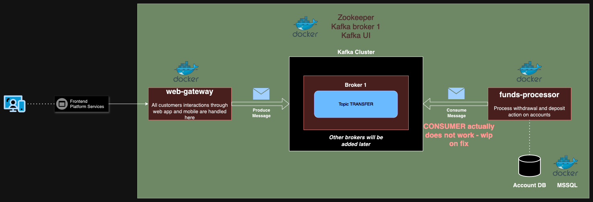

# Kafka PoC 🛠

This proof of concept aim to integrate Kafka through applications to stream actions.

The following schema explains a typical example of Kafka's usage : stream actions on money transfers (from account A to account B)



At the moment, in this PoC we will have 1  action to stream : 
* transfer

Web-gateway represents the backend of the mobile and web app, if user make money transfer through their UI, it will produce messages of transfer to the appropriate topic  
Funds-processor maintain the business logic around money transfer, transactions... It's listening messages from transfer topic to adjust customer's bank account (in mssql DB)

For the future :  
We could implement new consumer of transfer messages, 
called "notification-processor".
This app will consume message from this topic and notify customer if a withdrawal exceeds an amount

## Technical aspects  🐳

Requirement : Docker, docker-compose

Go to root folder of the project and then execute the following commands, 
it will start whole servers - web-gateway and funds-processors apps and their infra (zookeeper, kafka broker 1, kafka ui, mssql) :

```
docker-compose -f ./env/docker-compose.yml --env-file ./env/.env.local --project-name kafka-poc-infra up -d
```

## Useful links 🔗
One docker-compose ended successfully, you can use following links to facilitate use of different apps, 
visualize contracts and kafka messages :  

* Funds processors contract : http://localhost:8080/funds-processor/swagger-ui.html (useful to check balance on account)
* Web-gateway contract : http://localhost:8081/web-gateway/swagger-ui.html (useful to send transfer money action, that will produce message in kafka)
* Kafka UI : http://localhost:9090 (useful to monitoring kafka cluster)
* Kafka UI : http://localhost:9090/ui/clusters/kafka-1/all-topics/transfer/messages (list messages sent on transfer topic )


## Tips :💡
If you want to change code from apps and start them from your IDE rather than docker :   
Delete the running containers and start them as you want (through IntelliJ, just run the main class)

## Todo list  📝

* Fix the consumer part (no error but listener does not work)
* Configure multiple broker (configuration issue when I tried it)
